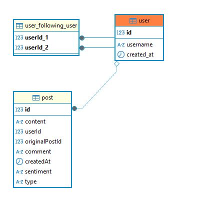

<p align="center">
  <a href="https://www.casar.com/">
    
  </a>
</p>

## Descrição do Projeto
<p>A Casar APi é uma API RESTful construída utilizando o framework NestJS. Ela simula uma rede social simples, similar ao Twitter, onde os usuários podem criar postagens, realizar re-postagens e interagir com postagens de outros usuários. Além disso, a API faz uma integração com um serviço de análise de sentimentos para classificar as postagens como positivas, negativas ou neutras.</p>
<p>🚀 Usei a linguagem de programação Typescript e o framework NestJS para desenvolver a API. Separei as camadas Controller, Services, Repository e provider para APIs externas.</p>
<p>🚀 Usei jest para teste unitario.</p>
<p>🚀 Usei Docker-Compose para Dockerizar a aplicação.</p>
<p>🚀 Usei banco de Dados PostgreSQL e o seu ORM para Typescript chamado typeorm, fiz com ele mapeamento de tabela e execução de querys.</p>

Tabela de conteúdos
=================
<!--ts-->
   * [Pre Requisitos](#pre-requisitos)
   * [Rodando o Back End](#-rodando-o-back-end)
   * [Rodando os Testes](#-rodando-os-testes)
   * [Tecnologias](#tecnologias)
   * [Lista de Rotas Post](#lista-de-rotas-post)
   * [Lista de Rotas Profile](#lista-de-rotas-profile)
   * [Diagramas de Sequência](#diagramas-de-sequêcia)
   * [Modelagem do Banco de Dados](#modelagem-do-banco-de-dados-der)
   * [O que poderia Melhorar ](#crítica)
<!--te-->

### Pré-requisitos

Antes de começar, você vai precisar ter instalado em sua máquina as seguintes ferramentas:
[Git](https://git-scm.com), [Node.js](https://nodejs.org/en/), [Docker](https://www.docker.com/). 
Além disto é bom ter um editor para trabalhar com o código como [VSCode](https://code.visualstudio.com/)

### 🎲 Rodando o Back End (servidor)

```bash
# Clone este repositório
$ git clone <https://github.com/isaiasflc/casar-api>

# Acesse a pasta do projeto no terminal/cmd
$ cd casar-api

# Instale as dependências
$ npm install

# Execute a aplicação pelo docker
$ docker-compose build
$ docker-compose up

# O servidor inciará na porta:3000 - acesse <http://localhost:3000/>
```

### 🎲 Rodando os Testes 

```bash
# Acesse a pasta do projeto no terminal/cmd
$ cd casar-api

# Instale as dependências caso nao tenha instalado ainda
$ npm install

# Execute os teste como o comando 
$ npm run test

```

### 🛠 Tecnologias

As seguintes ferramentas foram usadas na construção do projeto:

- [Node.js](https://nodejs.org/en/)
- [Typescript](https://www.typescriptlang.org/)
- [PostgreSQL](https://www.postgresql.org/)
- [Jest](https://jestjs.io/pt-BR/)
- [Docker](https://www.docker.com/)

### Lista de Rotas Post

<p>Criar um post</p>

     curl --location --request POST 'http://localhost:3000/post/{userId}' \
      --header 'Content-Type: application/json' \
      --data-raw '{
          "content": "string",
          "comment": "string",
          "originalPostId": 0
      }' 

<p>Obter postagens de um usuario. Usado quando algum usuario A for visitar o perfil do usuario B.</p> 
    <span>userId fornecido como parametro corresponde ao usuario visitado.</span><br> 
    <span>limit é a quantidade de posts que serão retornada.</span><br>
    <span>page indica a pagina que queremos buscar.</span><br>

    curl --location 'http://localhost:3000/post/:userId?limit=5&page=1' \

<p>Obter todas as postagens. Usado quando algum usuario está em seu feed.</p> 
    <span> userId fornecido como parametro corresponde ao usuario do feed.</span><br> 
    <span> limit é a quantidade de posts que serão retornada.</span><br>
    <span> page indica a pagina que queremos buscar.</span><br>
    <span> following um booleano para controlar a busca de postagens, se true retornar só postagens dos usuarios que sigo, se false retornar todas as postagens existentes.</span><br>
    
    curl --location 'http://localhost:3000/post/:userId?limit=5&page=1' \

### Lista de Rotas Profile

<p>Obter perfil</p>
    <span> userId fornecido como parametro, corresponde ao usuario cujo o perfil está sendo visitado</span><br>
    <span> currentUserId fornecido como query, corresponde ao usuario que está visitando o perfil</span><br>

    curl -X 'GET' \
      'http://localhost:3000/profile/:userId?currentUserId=1' \
      -H 'accept: application/json'

<p>Rota que permite seguir um perfil</p>
    <span> userId fornecido como parametro, corresponde ao usuario atual que quer seguir outro perfil</span><br>
    <span> targetUserId  fornecido como query, corresponde ao usuario que será seguido</span><br>
    
    curl -X 'PATCH' \
      'http://localhost:3000/profile/1/follow?targetUserId=2' \
      -H 'accept: application/json'

<p>Rota que permite deixar de seguir um perfil</p>
    <span> userId fornecido como parametro, corresponde ao usuario atual que quer deixar de seguir outro perfil</span><br>
    <span> targetUserId fornecido como query, corresponde ao usuario que está perdendo um seguidor</span><br>
    
    curl -X 'PATCH' \
      'http://localhost:3000/profile/1/unfollow?targetUserId=1' \
      -H 'accept: application/json'

### Diagramas de Sequêcia

- Fluxo Post:

<p align="center"> </p>

- Fluxo Profile:

<p align="center">  </p>

### Modelagem do banco de dados (DER)

<p align="center"> </p>

### Crítica

O código da aplicação apresenta várias oportunidades de melhoria. Primeiramente, é fundamental adicionar mais logs, o que permitiria um melhor acompanhamento e diagnóstico de problemas em tempo real, além de facilitar a depuração em ambientes de produção. A documentação com Swagger também precisa ser ampliada, pois ela é essencial para que os desenvolvedores, tanto atuais quanto futuros, possam entender a API de forma clara e eficiente, reduzindo a curva de aprendizado e evitando mal-entendidos. Além disso, testes integrados E2E (end-to-end) devem ser implementados, já que cobrem todo o fluxo de funcionalidade e garantem que diferentes componentes do sistema estejam funcionando corretamente em conjunto. Outra melhoria crítica seria fazer uso de interfaces e DTOs, o que traria uma maior padronização e consistência na tipagem dos dados, facilitando a manutenção e a escalabilidade da aplicação.

Em termos de segurança, a aplicação também apresenta deficiências consideráveis. Um ponto prioritário seria adicionar um mecanismo de autenticação, como JWT (JSON Web Tokens), para garantir que apenas usuários autenticados possam acessar ou modificar informações sensíveis. Além disso, é imperativo não trafegar chaves primárias da base de dados nas requisições, uma vez que isso pode expor a estrutura interna do banco, aumentando o risco de ataques. Outra questão grave é a prática de executar alterações na base com IDs fornecidos diretamente na request, o que pode abrir brechas para vulnerabilidades, como a manipulação mal-intencionada de IDs.

No aspecto de escalabilidade, algumas estratégias também devem ser revistas. Primeiramente, é crucial implementar estratégias de cache, que podem reduzir significativamente o tempo de resposta e aliviar a carga sobre o banco de dados em operações repetitivas. Além disso, o uso de um banco de dados mais adequado para relacionamentos complexos entre entidades pode melhorar a performance, uma vez que a atual solução pode não ser a mais eficiente para casos de alta carga de dados relacionais. Outra medida recomendada seria a utilização de clusters, que permite que a aplicação suporte um volume maior de tráfego, distribuindo a carga de forma eficiente. Por fim, a dependência de uma API externa pode se tornar um gargalo; para mitigar esse risco, seria interessante explorar o uso de filas de mensagens ou até eventos, o que permitiria um processamento assíncrono e evitaria a sobrecarga de chamadas simultâneas.

Essas ações podem melhorar significativamente o desempenho, segurança e escalabilidade da aplicação, tornando-a mais robusta e preparada para crescimento futuro.